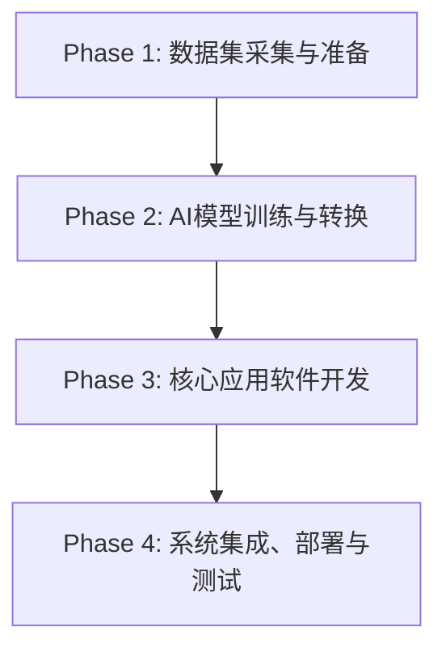

# AI教学实验箱：基于计算机视觉的数字积木排序机械臂项目

## 1. 项目概述

本项目旨在利用人工智能教学实验箱，实现一个从数据采集、模型训练到硬件控制的完整AI应用。系统通过摄像头识别“仓库一”中的数字积木，根据数字大小进行降序排序，并控制机械臂将积木按排序结果搬运至“仓库二”。

本项目强调从零开始，所有图像数据均需自行采集，识别模型需自行训练，并在软件层面解决实际环境中光照、位置、方向等干扰因素。

**核心技术栈：**

* **硬件平台：** 人工智能教学实验箱 (AI运算单元, AI控制单元, 机械臂)
* **数据采集/处理：** Python, OpenCV
* **模型训练框架：** PaddlePaddle
* **模型部署框架：** PaddleLite
* **应用软件开发：** C++, Qt, OpenCV C++ API

---

## 2. 项目工作流

项目遵循标准的AI应用开发流程：



---

## 3. Phase 1: 数据集采集与准备

**目标：** 构建一个高质量、多样化的数字积木图像数据集，以应对真实环境的干扰。

### 3.1. 环境准备

确保您的PC或实验箱的开发环境中已安装Python和OpenCV。

```bash
pip install opencv-python
```

### 3.2. 创建数据集目录结构

为每个数字（0-9）创建一个独立的文件夹，用于存放采集的图像。

```od
/home/user/digital_dataset/
├── 0/
├── 1/
├── 2/
├── 3/
├── 4/
├── 5/
├── 6/
├── 7/
├── 8/
└── 9/
```

### 3.3. 编写数据采集脚本

使用以下Python脚本进行图像采集。该脚本会打开摄像头，您可以按键盘上的数字键`0-9`来保存当前帧到对应的文件夹中。

`collect_data.py`:

```python
import cv2
import os
import time

# --- 配置区 ---
DATASET_PATH = "digital_dataset"  # 数据集保存的根目录
CAMERA_INDEX = 0  # 摄像头索引号，通常为 0
# --- 配置区结束 ---

# 确保数据集目录存在
if not os.path.exists(DATASET_PATH):
    os.makedirs(DATASET_PATH)
for i in range(10):
    dir_path = os.path.join(DATASET_PATH, str(i))
    if not os.path.exists(dir_path):
        os.makedirs(dir_path)

# 打开摄像头
cap = cv2.VideoCapture(CAMERA_INDEX)
if not cap.isOpened():
    print("错误：无法打开摄像头！")
    exit()

print("摄像头已启动...")
print("按键盘上的数字 '0'-'9' 保存图像到对应文件夹。")
print("按 'q' 键退出。")

while True:
    ret, frame = cap.read()
    if not ret:
        print("错误：无法读取视频帧！")
        break

    # 在窗口中显示实时视频流
    cv2.imshow('Data Collection - Press 0-9 to Save, Q to Quit', frame)

    key = cv2.waitKey(1) & 0xFF

    # 按 'q' 退出
    if key == ord('q'):
        break

    # 按数字键保存图像
    if ord('0') <= key <= ord('9'):
        digit = chr(key)
        save_dir = os.path.join(DATASET_PATH, digit)
        # 使用时间戳作为文件名，避免重复
        filename = f"{int(time.time() * 1000)}.jpg"
        save_path = os.path.join(save_dir, filename)
        
        # 保存图像
        cv2.imwrite(save_path, frame)
        print(f"成功保存图像 -> {save_path}")

# 释放资源
cap.release()
cv2.destroyAllWindows()
print("采集完成！")
```

### 3.4. 采集策略（关键步骤）

为了让模型更具鲁棒性，采集时必须模拟各种干扰：

* **光照变化：** 在不同时间（白天/夜晚）、不同光源（顶灯/台灯）下采集。用手或白纸在积木上方制造阴影。
* **位置变化：** 将积木放在“仓库一”四个格子的不同角落。
* **角度变化：** 将积木进行小范围的旋转（-15° 到 +15°）。
* **背景干扰：** 刻意让机械臂的爪子、其他工具或手指出现在画面边缘。
* **数量：** 为每个数字采集 **100-200** 张图像。

### 3.5. 划分数据集

将采集到的数据手动或通过脚本按 **8:1:1** 的比例划分为训练集（`train`）、验证集（`val`）和测试集（`test`）。

---

## 4. Phase 2: AI模型训练与转换

**目标：** 训练一个轻量、高效的数字识别模型，并将其转换为可在嵌入式设备上运行的格式。

### 4.1. 选择模型架构

**LeNet-5** 是一个经典且非常适合此任务的卷积神经网络（CNN）模型。它结构简单，计算量小，易于训练。

### 4.2. 编写训练脚本（使用PaddlePaddle）

此步骤需要在PC上完成。

1. **安装PaddlePaddle:** `pip install paddlepaddle`
2. **编写训练逻辑：**
    * **数据加载：** 使用 `paddle.vision.datasets.DatasetFolder` 加载您在Phase 1中准备好的数据集。
    * **数据预处理/增强：** 定义 `transforms`，包括：
        * `Resize`: 调整到模型输入尺寸（如 32x32）。
        * `Grayscale`: 转换为灰度图。
        * `Normalize`: 对像素值进行归一化。
        * （可选）`RandomRotation`, `ColorJitter` 等数据增强操作。
    * **模型组网：** 使用PaddlePaddle API搭建LeNet-5模型。
    * **训练配置：** 定义损失函数（`CrossEntropyLoss`）、优化器（`Adam`）和评价指标（`Accuracy`）。
    * **执行训练：** 编写训练循环，迭代数据集，更新模型参数，并在每个epoch后使用验证集评估模型，保存最佳模型。

### 4.3. 模型转换 (部署关键)

训练完成后，将PaddlePaddle模型转换为PaddleLite模型。

1. **获取`opt`工具：** 参考实验手册第68页，下载或从源码编译PaddleLite的`opt`模型优化工具。
2. **执行转换命令：**

    ```bash
    # 假设你的PaddlePaddle模型保存在 ./lenet_infer_model/ 目录
    # 将模型转换为ARM平台可用的.nb格式
    ./opt --model_dir=./lenet_infer_model/ \
          --optimize_out_type=naive_buffer \
          --optimize_out=digital_rec_opt \
          --valid_targets=arm
    ```

3. **获取结果：** 转换成功后，会在 `digital_rec_opt` 目录下生成 `model.nb` 和 `params.nb` 文件。这两个文件就是我们最终要在应用程序中使用的模型。

---

## 5. Phase 3: 核心应用软件开发 (C++/Qt)

**目标：** 开发一个集成了CV算法、AI模型推理和硬件控制的Qt应用程序。

### 5.1. 图像处理与积木定位

这是**在软件层解决干扰**的核心。

1. **定位仓库格：**
    * 从摄像头获取RGB图像。
    * 将图像从RGB转换到HSV色彩空间，因为HSV对光照变化不敏感。
    * 使用`cv::inRange`函数，根据仓库格子的黑色背景设置颜色阈值，生成一个二值化掩码。
    * 对掩码进行形态学操作（如开运算、闭运算）以去除噪点。
    * 使用`cv::findContours`和`cv::boundingRect`找到四个独立的、矩形的格子区域。
2. **提取并预处理积木图像：**
    * 根据上一步得到的矩形框，从原始图像中将四个积木的图像**裁剪**出来。
    * 对每个裁剪出的图像执行与**训练时完全相同**的预处理步骤：
        * 转换为灰度图。
        * 尺寸调整为模型输入大小（如 32x32）。
        * 像素值归一化。

### 5.2. AI模型推理与业务逻辑

1. **加载模型：** 使用PaddleLite的C++ API加载`.nb`模型文件。
2. **执行推理：**
    * 将预处理后的四个积木图像数据依次送入模型。
    * 获取模型的输出，即每个图像对应的数字类别（0-9）。
3. **排序与决策：**
    * 创建一个数据结构（如`struct`或`std::vector<std::pair<int, int>>`）来存储识别出的`数字`及其在仓库一中的`原始位置索引`（0-3）。
    * 使用`std::sort`和自定义的lambda表达式，对该数据结构按`数字`进行**降序**排序。
    * 根据排序后的结果，生成一个清晰的机械臂动作序列。

### 5.3. 机械臂控制

1. **坐标标定：** 提前通过手动控制或调试，测量并记录下“仓库一”和“仓库二”中每个格子的精确三维坐标（或机械臂各关节角度）。将这些坐标硬编码或写入配置文件。
2. **封装通信指令：**
    * 编写一个函数，如`void controlArm(int from_pos_idx, int to_pos_idx)`。
    * 该函数根据输入的起始和目标位置索引，从标定好的坐标中查找对应的坐标。
    * 将坐标数据打包成符合M3控制器串口通信协议的字节流。
3. **串口通信：** 使用Qt的`QSerialPort`类，将封装好的指令通过串口发送给AI控制单元。

---

## 6. Phase 4: 系统集成、部署与测试

1. **创建GUI：** 使用Qt Designer设计一个简单的用户界面，至少包含一个“**开始排序**”按钮和一个用于显示摄像头画面的`QLabel`。
2. **连接信号与槽：** 将“开始排序”按钮的`clicked()`信号连接到一个槽函数，该槽函数将启动整个识别和搬运流程。
3. **部署：**
    * 将编译好的Qt应用程序。
    * 将转换后的模型文件 (`model.nb`, `params.nb`)。
    * 所有必需的动态链接库（如OpenCV, PaddleLite, Qt的库）。
    * 一起拷贝到实验箱AI运算单元的同一个目录下。
4. **最终测试：**
    * 在“仓库一”中随机放置2-4块数字积木。
    * 运行应用程序，点击“开始排序”按钮。
    * 观察并验证机械臂是否能准确地按照数字降序将积木搬运到“仓库二”。

---

## 7. 可能遇到的问题及解决方案

| 问题 | 可能原因 | 解决方案 |
| :--- | :--- | :--- |
| **数字识别准确率低** | 1. 数据集质量不高，多样性不足。<br>2. 模型欠拟合或过拟合。<br>3. 应用中的图像预处理与训练时不一致。 | 1. 重新采集数据，确保覆盖各种光照、角度和位置。<br>2. 调整模型结构或训练超参数（学习率、epoch数），增加数据增强。<br>3. **仔细检查**并确保应用中的预处理代码（缩放、灰度、归一化）与训练脚本完全相同。 |
| **机械臂抓取位置不准** | 1. 坐标标定不精确。<br>2. 摄像头畸变或安装角度导致视觉定位有偏差。 | 1. 重新进行细致的坐标标定，可多次微调取平均值。<br>2. 在CV算法中加入摄像头畸变校正步骤。或者，在计算抓取点时，根据积木在格子内的偏移量进行微调补偿。 |
| **无法定位仓库格子** | 1. HSV颜色阈值设置不当。<br>2. 环境光线极端（太亮或太暗）。 | 1. 编写一个调试工具，实时显示HSV阈值分割后的掩码图像，动态调整阈值范围直至效果最佳。<br>2. 在算法中加入**自适应阈值** (`cv::adaptiveThreshold`)，它对光照变化更鲁棒。 |
| **应用程序崩溃** | 1. 模型文件或库文件路径错误。<br>2. 内存访问越界（如访问不存在的轮廓）。 | 1. 确保所有文件都已正确部署到运行目录，使用相对路径或绝对路径时要小心。<br>2. 在处理CV结果（如轮廓、矩形框）前，务必检查其是否为空或数量是否符合预期。增加保护性代码 `if (!contours.empty()) { ... }`。 |